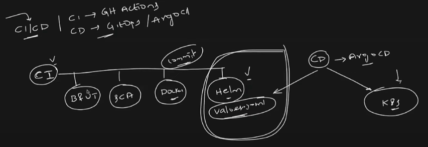

# STEPS OR STAGES FOR THE APPLICATION DEPLOYMENT

#  CI
- Stage 1 : Build and Unit Test
- Stage 2 : Static code analysis
- Stage 3 : Docker image & push 
- Stage 4 : Update Helm with docker image that we have created


# CD
- Check for helm chats and deploy in kubernetes cluster.



## IGNORE PATH IN GITHUB ACTIONS
- .github/workflows/CI-CD.yml   

``` 
 path-ignore:
            - 'docs/**'
            - 'README.md'
            - 'helm/**'

```
# NOTE : WE DONT WANT TO RUN THE CI PIPELINE WHEN THERE IS CHANGE IN README.MD FILE, DOCS OR ETC FILES, BE'COZ THAT IS NOT REALTED TO CODE, HERE WHY WE ARE IGNORING HELM FILES BE'COZ ONCE WE UPDATE THE HELM FILES ARGO CD WILL AUTOMATICALLY TAKE THE CHAGNES TO DEPLOY IT.

