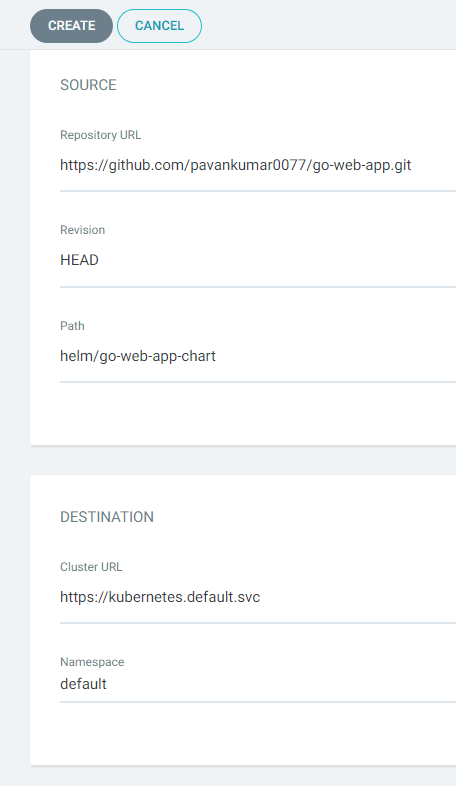

## Install ARGO CD USING MANIFESTS file

``` 
kubectl create namespace argocd
kubectl apply -n argocd -f https://raw.githubusercontent.com/argoproj/argo-cd/stable/manifests/install.yaml
```
## ACCESS THE ARGO CD UO (Loadbalancer service)
``` kubectl patch svc argocd-server -n argocd -p '{"spec": {"type": "LoadBalancer"}}' ```

## ACCESS THE ARGO CD UI (Loadbalancer service)
``` kubectl patch svc argocd-server -n argocd -p '{"spec": {"type": "LoadBalancer"}}' ```

-- IF WE GET ERROR USE THIS COMMAND 
``` kubectl patch svc argocd-server -n argocd --type='json' -p '[{"op": "replace", "path": "/spec/type", "value": "LoadBalancer"}]' ```


## Get the loadbalancer service ip
``` kubectl get svc argocd-server -n argocd ```

### TO GET THE ARGO CD PASSWORD 
```
PS D:\Pavan-Files\AWS-Devops-YT-Abhi\Pavan-Learnings\go-web-app> kubectl get secrets -n argocd
NAME                          TYPE     DATA   AGE
argocd-initial-admin-secret   Opaque   1      4m38s
argocd-notifications-secret   Opaque   0      4m54s
argocd-redis                  Opaque   1      4m42s
argocd-secret                 Opaque   5      4m54s
PS D:\Pavan-Files\AWS-Devops-YT-Abhi\Pavan-Learnings\go-web-app> kubectl edit secret argocd-initial-admin-secret
Error from server (NotFound): secrets "argocd-initial-admin-secret" not found
PS D:\Pavan-Files\AWS-Devops-YT-Abhi\Pavan-Learnings\go-web-app> kubectl edit secret argocd-initial-admin-secret -n argocd 
Edit cancelled, no changes made.
PS D:\Pavan-Files\AWS-Devops-YT-Abhi\Pavan-Learnings\go-web-app> 
```
### decode the password

``` https://www.base64decode.org/ ```
- When you don't have ubuntu machine this above website to decode the initial passowrd

### CREATE NEW APP
- 
- Here self means -- it is single truth of trust,
- IF THERE IS ANY CHANGE THAT WE DO MANUALLY, IF ONLY FOLLOW WHAT IS THERE IS GITHUB REPO ONLY.
- 
- 