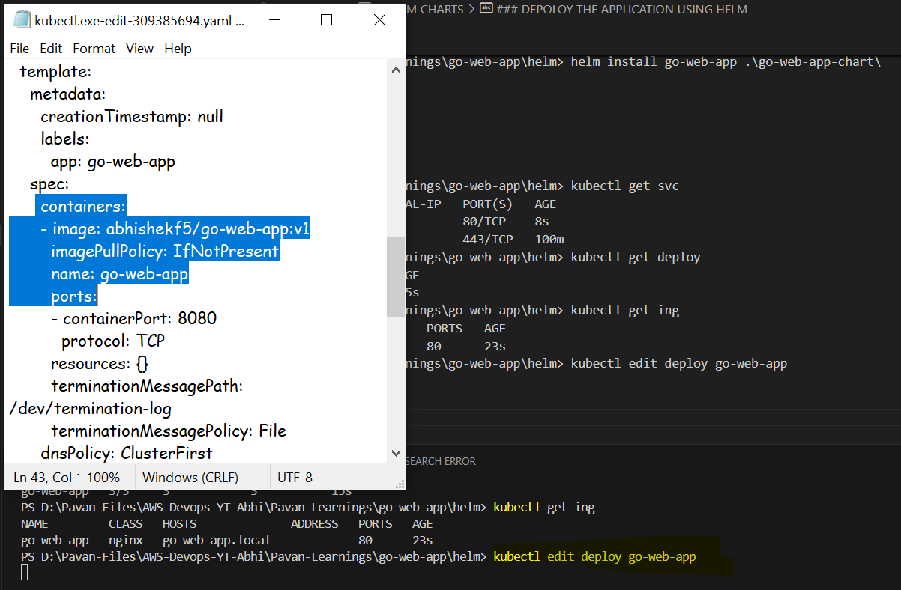

# HELM CHARTS

- To create helm chart
``` helm create go-web-app-chart ```

or 

- We can also use kutomize as well

- 

- 

- Now go inside the folder where helm command is used and you will find some of the files created
- ``` Chart.yaml, templates and values.yaml ```
- These are the imp files or folders

### CHART.YAML 
- It provides the information about the chart like meta data of the chart, explain about helm

### Templates folder
- Imp and main resource
- Delete everything that helm created (Just a good pratics)
- Now copies the kubernete manifest files like deployment.yaml, service and ingress to template folder

### ADVANTAGE OF HELM
- WE CAN VARIABILZE YOUR YAML FILES
- ``` image: abhishekf5/go-web-app:{{ .Values.image.tag }} ``` This change in the templates folder where we have copies all the manifest files not the main manifest files.
- Now we can change the image tag in values.yaml file
- Now go to values.yaml file and delete all the content 
- 
```
image:
  repository: abhishekf5/go-web-app
  pullPolicy: IfNotPresent
  # Overrides the image tag whose default is the chart appVersion.
  tag: "v1"
```
- Here we have changed the image tag to v1
- But it will change dynamically when we use CICD 
- Delete all the resources and re-create it using helm

```
PS D:\Pavan-Files\AWS-Devops-YT-Abhi\Pavan-Learnings\go-web-app\helm\go-web-app-chart> kubectl get all
NAME                              READY   STATUS    RESTARTS   AGE
pod/go-web-app-7d6d9b4dc4-kqxrz   1/1     Running   0          86m
pod/go-web-app-7d6d9b4dc4-xnf7h   1/1     Running   0          86m
pod/go-web-app-7d6d9b4dc4-zpkmv   1/1     Running   0          86m

NAME                 TYPE        CLUSTER-IP      EXTERNAL-IP   PORT(S)        AGE
service/go-web-app   NodePort    10.100.17.134   <none>        80:32519/TCP   85m
service/kubernetes   ClusterIP   10.100.0.1      <none>        443/TCP        96m

NAME                         READY   UP-TO-DATE   AVAILABLE   AGE
deployment.apps/go-web-app   3/3     3            3           86m

NAME                                    DESIRED   CURRENT   READY   AGE
replicaset.apps/go-web-app-7d6d9b4dc4   3         3         3       86m
PS D:\Pavan-Files\AWS-Devops-YT-Abhi\Pavan-Learnings\go-web-app\helm\go-web-app-chart> kubectl delete deploy go-web-app
deployment.apps "go-web-app" deleted
PS D:\Pavan-Files\AWS-Devops-YT-Abhi\Pavan-Learnings\go-web-app\helm\go-web-app-chart> kubectl delete svc  go-web-app
service "go-web-app" deleted
PS D:\Pavan-Files\AWS-Devops-YT-Abhi\Pavan-Learnings\go-web-app\helm\go-web-app-chart> kubectl delete ing  go-web-app
ingress.networking.k8s.io "go-web-app" deleted
PS D:\Pavan-Files\AWS-Devops-YT-Abhi\Pavan-Learnings\go-web-app\helm\go-web-app-chart>
```
### DEPOLOY THE APPLICATION USING HELM
```
PS D:\Pavan-Files\AWS-Devops-YT-Abhi\Pavan-Learnings\go-web-app\helm> dir


    Directory: D:\Pavan-Files\AWS-Devops-YT-Abhi\Pavan-Learnings\go-web-app\helm

PS D:\Pavan-Files\AWS-Devops-YT-Abhi\Pavan-Learnings\go-web-app\helm> helm install go-web-app .\go-web-app-chart\
NAME: go-web-app
LAST DEPLOYED: Sun Jul 21 17:33:01 2024
NAMESPACE: default
STATUS: deployed
REVISION: 1
TEST SUITE: None
PS D:\Pavan-Files\AWS-Devops-YT-Abhi\Pavan-Learnings\go-web-app\helm> kubectl get svc
NAME         TYPE        CLUSTER-IP      EXTERNAL-IP   PORT(S)   AGE 
go-web-app   ClusterIP   10.100.38.147   <none>        80/TCP    8s  
kubernetes   ClusterIP   10.100.0.1      <none>        443/TCP   100m
PS D:\Pavan-Files\AWS-Devops-YT-Abhi\Pavan-Learnings\go-web-app\helm> kubectl get deploy 
NAME         READY   UP-TO-DATE   AVAILABLE   AGE
go-web-app   3/3     3            3           15s
PS D:\Pavan-Files\AWS-Devops-YT-Abhi\Pavan-Learnings\go-web-app\helm> kubectl get ing
NAME         CLASS   HOSTS              ADDRESS   PORTS   AGE
go-web-app   nginx   go-web-app.local             80      23s
PS D:\Pavan-Files\AWS-Devops-YT-Abhi\Pavan-Learnings\go-web-app\helm> kubectl edit deploy go-web-app
```
- Now check the image tag version is comming for the values.yaml file
- 

## To delete all the resources using HELM

``` helm uninstall go-web-app ```


