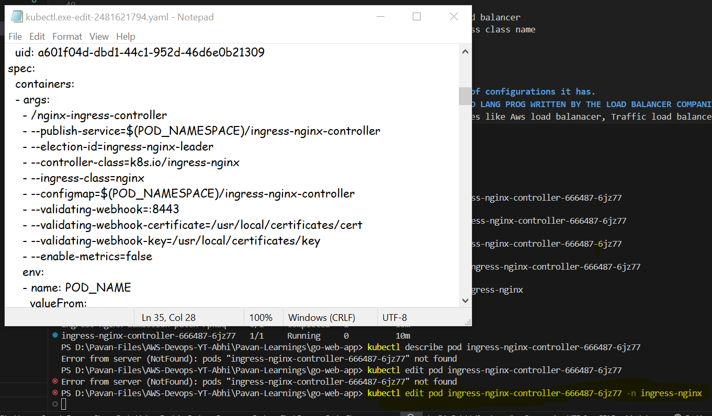
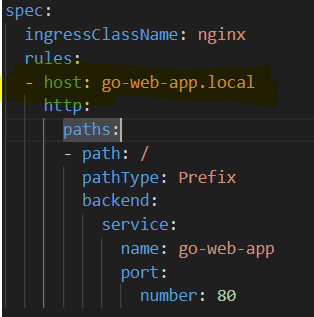
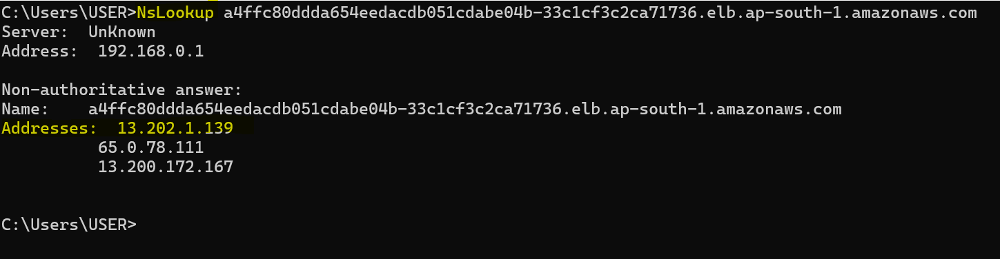

``` ingressClassName ``` - Ingress class name is for the ingress resource to be identified by the ingress controller, In some org's their can be multiple ingress controllers - Some organizations may Nginx, AWS load balancers and etc.

- Multiple development teams may ask for multiple ingress controllers

- Now Ingrewss controllers within the Kubernetes clusters need to be identified by those ingress controllers 

- If we provide the ingress class name then it is tells the nginx ingress controller THAT IS IS THE INGRESS RESOURCE THAT YOU NEED TO WATCH FIRST. 

- IF WE ARE NOT PROVIDING THE INGRESS CLASS NAME, THAT INGRESS CONTROLLER WILL NOT WATCH THE INGRESS RESOURCE.


- To list the ingress resource 
``` kubectl get ingress or ing ```

- To Get the node external ip addresses

``` kubectl get nodes -o wide ```
```
NAME                                            STATUS   ROLES    AGE     VERSION               INTERNAL-IP      EXTERNAL-IP     OS-IMAGE         KERNEL-VERSION                  CONTAINER-RUNTIME
ip-192-168-41-218.ap-south-1.compute.internal   Ready    <none>   8m12s   v1.30.0-eks-036c24b   192.168.41.218   13.201.125.70   Amazon Linux 2   5.10.219-208.866.amzn2.x86_64   containerd://1.7.11
ip-192-168-9-89.ap-south-1.compute.internal     Ready    <none>   8m20s   v1.30.0-eks-036c24b   192.168.9.89     3.110.97.34     Amazon Linux 2   5.10.219-208.866.amzn2.x86_64   containerd://1.7.11
```

- Get the svc port and external ip address to get the application
```
kubectl get svc
NAME         TYPE        CLUSTER-IP      EXTERNAL-IP   PORT(S)        AGE
go-web-app   NodePort    10.100.17.134   <none>        80:32437/TCP   9m27s
kubernetes   ClusterIP   10.100.0.1      <none>        443/TCP        19m
```
- To get the application live 
``` http://13.201.125.70:32437/courses ```

- Now the application is running with node port 

- Now let's work with INGRESS CONTROLLER AND TRY TO RUN THE APPLICATION WITH INGRESS RESOURCE


- To install INGRESS CONTROLLER 
``` https://kubernetes.github.io/ingress-nginx/deploy/#aws ```

- docs ``` https://github.com/kubernetes/ingress-nginx ```
- It will create a Network load balancer

## INGRESS
1. Ingress
2. Ingress Controller
3. Load balancer

- Ingress (ingress resource)   -- Ingress Controller  -- (creates LB)   Load balancer
- Here Ingress controller will watch for te ingress resource by using ingress class name
- And creates Load balancer


### In kubernetes cluser is not that easy to create a load balancer be'coz of configurations it has.
### SO WE WRITE A INGRESS FILE, INGRESS CONTROLLER WHICH IS IMPLEMENTED A GO LANG PROG WRITTEN BY THE LOAD BALANCER COMPANIES - NIGNX 
- There are different different load balancer provided by different companies like Aws load balanacer, Traffic load balancer and etc

- Confirm or check the ingress class name 


``` kubectl edit pod ingress-nginx-controller-666487-6jz77 -n ingress-nginx ```
``` kubectl edit pod <pod-name> -n <name-space> ```

- Verify the ingress controller is watching for our ingress resource or not
``` kubectl get ing ```

``` 
kubectl get ing
NAME         CLASS   HOSTS              ADDRESS                                                                          PORTS   AGE
go-web-app   nginx   go-web-app.local   a4ffc80ddda654eedacdb051cdabe04b-33c1cf3c2ca71736.elb.ap-south-1.amazonaws.com   80      34m

```
- It is given Full qualified name or ALB address (Load balancer address)

- BUT APPLICATION WILL NTO BE ACCESSABLE BUT IT IS NOT WHAT WE HAVE MENTIONED IN INGRESS RESOURCE 

- 

- Here we have clearly mentioned that we need to give go-web-applocal
- For there we need to Configure in the DNS in the DNS records,
- As of now we are uinsg local dns (timestap 56:43)
- So to get the ip address for the ALB that aws provided use any of the command like nsloopup, dig or dns propagration and etc and ge the ip address.
- 
- In the ingress resource if need to give DNS name only, not an IP address

- Real time in ORGANISATION's we need DNS method not the local one and the domain will be like amazon.com or flipkart.com some like that.

- How to edit hosts in windows 10 
``` https://www.hostinger.in/tutorials/how-to-edit-hosts-file ```

- In windows go to file path ``` C:\Windows\system32>cd C:\Windows\System32\drivers\etc ```
- use notepad file-name to edit
- use type file-name to display the contents

